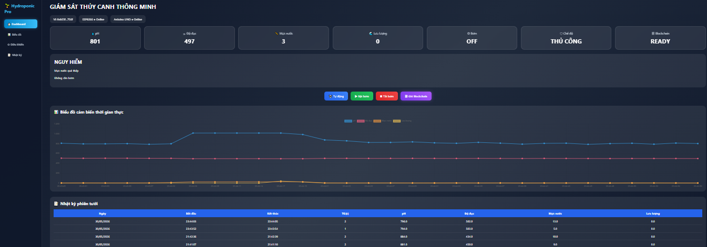
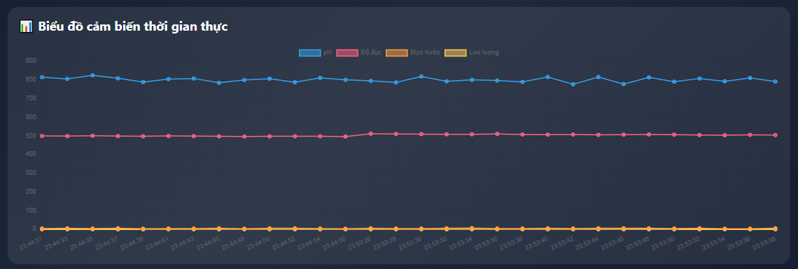
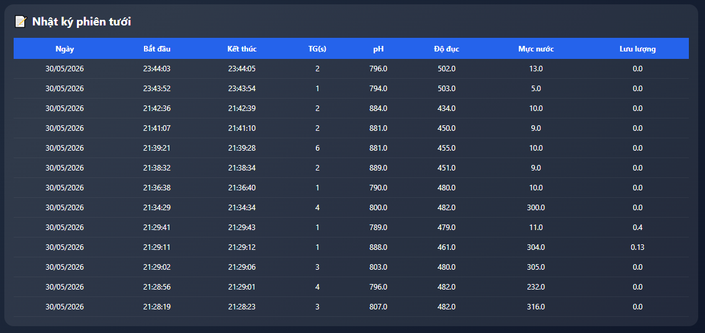
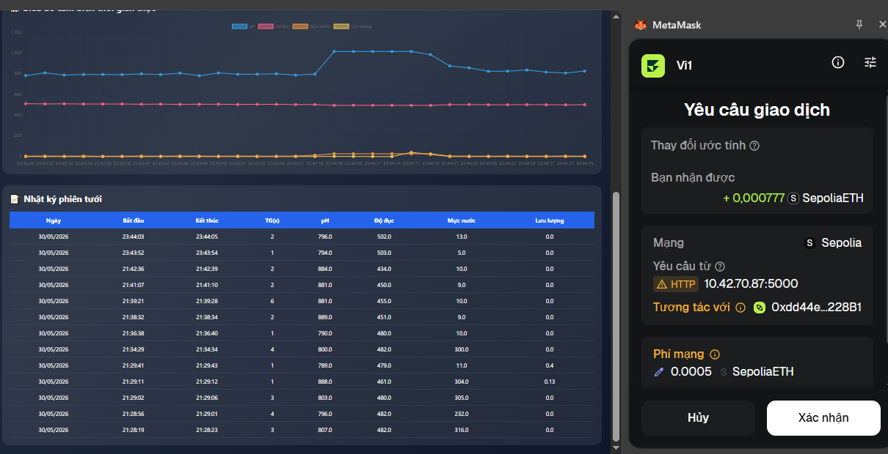
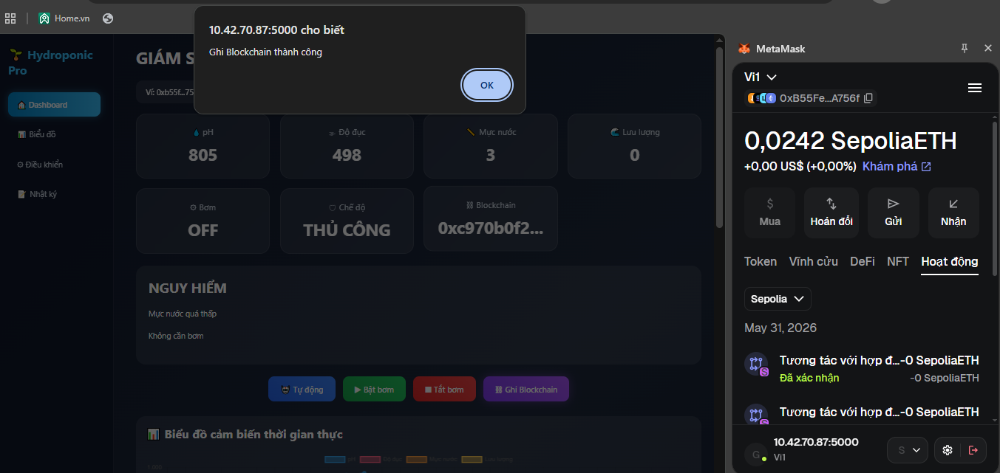
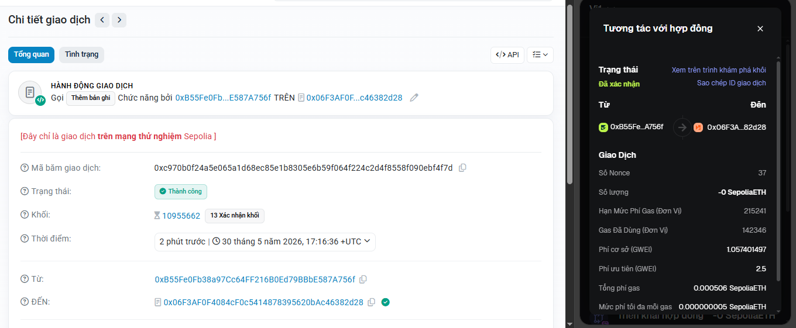

<h2 align="center">
    <a href="https://dainam.edu.vn/vi/khoa-cong-nghe-thong-tin">
    🎓 Faculty of Information Technology (DaiNam University)
    </a>
</h2>
<h2 align="center">
   HỆ THỐNG GIÁM SÁT THỦY CANH THÔNG MINH ỨNG DỤNG IOT VÀ BLOCKCHAIN
</h2>
<div align="center">
    <p align="center">
        
        
        
    </p>

[](https://www.facebook.com/DNUAIoTLab)
[](https://dainam.edu.vn/vi/khoa-cong-nghe-thong-tin)
[](https://dainam.edu.vn)

</div>

<h2 align="center">
    <a href="https://dainam.edu.vn/vi/khoa-cong-nghe-thong-tin">
    🎓 Faculty of Information Technology (DaiNam University)
    </a>
</h2>

<h2 align="center">
   GIÁM SÁT CHẤT LƯỢNG NƯỚC TRONG HỆ THỐNG THỦY CANH ỨNG DỤNG IoT VÀ BLOCKCHAIN
</h2>

<div align="center">

[](https://www.facebook.com/DNUAIoTLab)

[](https://dainam.edu.vn/vi/khoa-cong-nghe-thong-tin)

[](https://dainam.edu.vn)

</div>

---

# 📖 1. Giới thiệu

Trong bối cảnh nông nghiệp thông minh ngày càng phát triển, việc giám sát chất lượng nước trong hệ thống thủy canh đóng vai trò quan trọng nhằm đảm bảo sự sinh trưởng và phát triển của cây trồng.

Hệ thống được xây dựng dựa trên công nghệ Internet of Things (IoT), sử dụng Arduino UNO và ESP8266 để thu thập dữ liệu từ các cảm biến môi trường và truyền dữ liệu đến Flask Server thông qua mạng WiFi.

Ngoài ra, hệ thống còn tích hợp Blockchain Ethereum nhằm lưu trữ dữ liệu các phiên tưới, giúp đảm bảo tính minh bạch và toàn vẹn dữ liệu.

## 🔑 Chức năng chính

* Giám sát độ pH của nước.
* Giám sát độ đục của nước.
* Giám sát mực nước.
* Giám sát lưu lượng nước.
* Điều khiển bơm thủ công.
* Điều khiển bơm tự động.
* Hiển thị Dashboard thời gian thực.
* Lưu nhật ký các phiên tưới.
* Ghi dữ liệu lên Blockchain Ethereum Sepolia.
* Xác thực giao dịch bằng MetaMask.

---

# 🛠️ 2. Công nghệ sử dụng

## IoT

* Arduino UNO
* ESP8266 NodeMCU
* pH Sensor
* Turbidity Sensor
* Water Level Sensor
* Water Flow Sensor
* Relay Module 5V
* Water Pump

## Software

* Python
* Flask
* SQLite
* HTML5
* CSS3
* JavaScript
* Chart.js

## Blockchain

* MetaMask
* Ethereum Sepolia
* Web3.js

---

# 🚀 3. Kiến trúc hệ thống

```text
Cảm biến pH
Cảm biến độ đục
Cảm biến mực nước
Cảm biến lưu lượng
          │
          ▼
      Arduino UNO
          │ UART
          ▼
        ESP8266
          │ WiFi
          ▼
      Flask Server
      /         \
Dashboard      SQLite
                   │
                   ▼
               MetaMask
                   │
                   ▼
          Ethereum Sepolia
```

---

# 🖼️ 4. Hình ảnh hệ thống

## Dashboard

<p align="center">
  
</p>

<p align="center">
  <em>Hình 2: Giao diện Dashboard IoT Pro</em>
</p>

Dashboard hiển thị các thông số môi trường theo thời gian thực bao gồm độ pH, độ đục, mực nước và lưu lượng nước. Người dùng có thể theo dõi trạng thái hoạt động của hệ thống và điều khiển bơm trực tiếp trên giao diện Web.

Hiển thị:

* pH
* Độ đục
* Mực nước
* Lưu lượng
* Trạng thái bơm
* Chế độ hoạt động

---

## Biểu đồ thời gian thực

<p align="center">
  
</p>

<p align="center">
  <em>Hình 3: Biểu đồ dữ liệu cảm biến thời gian thực</em>
</p>

Biểu đồ cho phép theo dõi sự thay đổi của các thông số môi trường theo thời gian thực, hỗ trợ người dùng đánh giá tình trạng chất lượng nước trong hệ thống thủy canh.

Theo dõi dữ liệu cảm biến theo thời gian thực.

---

## Nhật ký phiên tưới

<p align="center">
  
</p>

<p align="center">
  <em>Hình 4: Nhật ký các phiên tưới</em>
</p>

Mỗi phiên tưới được lưu lại bao gồm ngày vận hành, thời gian bắt đầu, thời gian kết thúc, thời lượng hoạt động của bơm và các thông số môi trường tại thời điểm ghi nhận.

Lưu:

* Ngày vận hành
* Thời gian bắt đầu
* Thời gian kết thúc
* Thời lượng bơm
* Giá trị cảm biến

---

## MetaMask

<p align="center">
  
</p>

<p align="center">
  <em>Hình 6: MetaMask xác nhận giao dịch Blockchain</em>
</p>

Sau khi một phiên tưới kết thúc, người dùng có thể xác nhận giao dịch thông qua MetaMask để ghi dữ liệu lên Blockchain Ethereum Sepolia.

<p align="center">
  
</p>

<p align="center">
  <em>Hình 7: Dữ liệu được ghi thành công lên Blockchain</em>
</p>

Sau khi giao dịch được xác nhận, hệ thống hiển thị thông báo thành công và lưu mã giao dịch (Transaction Hash) để phục vụ việc tra cứu trên Blockchain.

Xác nhận giao dịch Blockchain.

---

## Ethereum Sepolia

<p align="center">
  
</p>

<p align="center">
  <em>Hình 8: Dữ liệu phiên tưới đã được lưu trữ</em>
</p>

Thông tin phiên tưới được lưu trữ bao gồm các thông số môi trường, thời gian vận hành và trạng thái hoạt động của hệ thống.

Theo dõi giao dịch đã được ghi thành công.

---

# ⚙️ 5. Cài đặt hệ thống

## Bước 1: Clone Repository

```bash
git clone https://github.com/6789aggy/BC_SMARTACT.git
cd "vào thư mục vừa clone về"
```

---

## Bước 2: Cài đặt thư viện

```bash
pip install -r requirements.txt
```

Hoặc:

```bash
pip install flask
pip install requests
pip install pyserial
pip install web3
```

---

## Bước 3: Chạy Flask Server

```bash
python blockchain.py
```

Server chạy tại:

```text
http://127.0.0.1:5000
```

---

## Bước 4: Nạp chương trình ESP8266

* Mở Arduino IDE.
* Chọn board ESP8266.
* Cập nhật địa chỉ IP Flask Server.
* Upload chương trình.

---

## Bước 5: Kết nối MetaMask

* Cài MetaMask Extension.
* Chọn mạng Ethereum Sepolia.
* Nạp Sepolia ETH.
* Kết nối ví với Dashboard.

---

# 📊 6. Kết quả đạt được

| Chức năng                | Kết quả |
| ------------------------ | ------- |
| Giám sát pH              | Đạt     |
| Giám sát độ đục          | Đạt     |
| Giám sát mực nước        | Đạt     |
| Giám sát lưu lượng       | Đạt     |
| Điều khiển bơm           | Đạt     |
| Dashboard thời gian thực | Đạt     |
| SQLite                   | Đạt     |
| Blockchain               | Đạt     |

---

# 🔮 7. Hướng phát triển

* Tích hợp AI dự đoán chất lượng nước.
* Gửi cảnh báo qua điện thoại.
* Lưu trữ dữ liệu trên Cloud.
* Hỗ trợ nhiều mô hình thủy canh.
* Tự động tối ưu thời gian tưới.

---

# 📬 8. Liên hệ

* Họ và tên: Lò Đức Mạnh
* Khoa: Công nghệ Thông tin
* Trường: Đại học Đại Nam

---

© 2026 AIoTLab, Faculty of Information Technology, DaiNam University.

